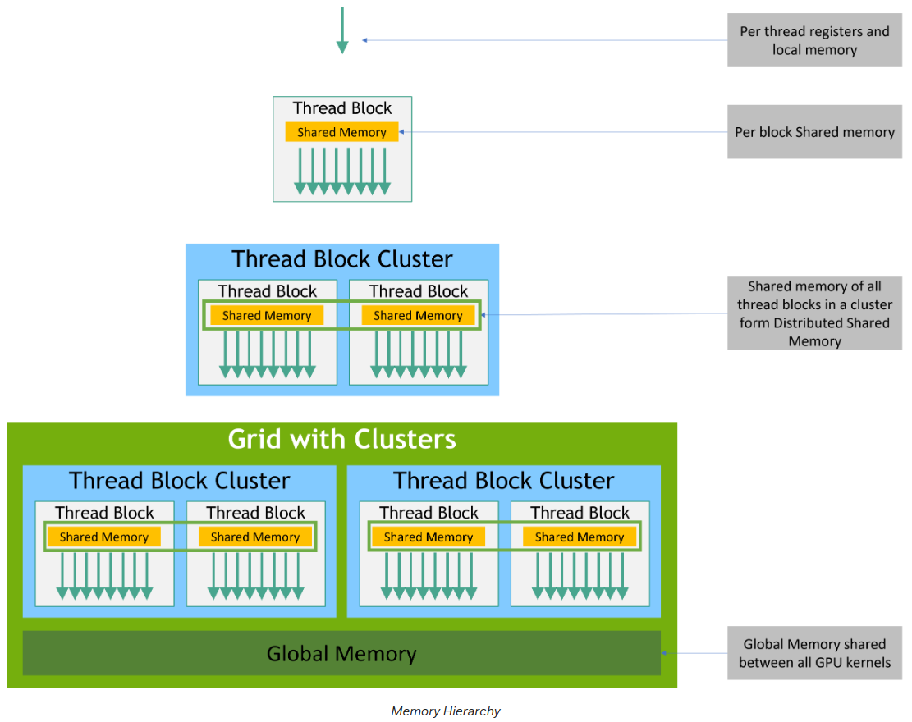
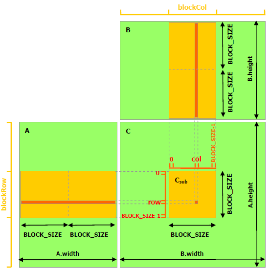

# CUDA programming samples

## Run
- Compile with `cmake`
```shell
$ mkdir build && cd build
$ cmake .. && make
```

- Compile directly with `nvcc`
```shell
$ nvcc vector_add.cu -o vector_add
$ ./vector_add
```

## Appendix

### [Thread Hierarchy](https://docs.nvidia.com/cuda/cuda-c-programming-guide/#thread-hierarchy)

- **Grid** ...set of blocks
  - **Block** ....set of threads
    - **Thread** -> **kernel**: Called function in each thread

*NOTE*: Maximum number of threads per block is 1024.



### [Shared Memory](https://docs.nvidia.com/cuda/cuda-c-programming-guide/index.html#shared-memory)

- Each thread block is responsible for computing one square sub-matrix.
  - Each thread within the block is responsible for computing one element of sub-matrix.
  - $A_{sub}\in\mathbb{R}^{\text{BLOCKSIZE}\times\text{A.width}}$
  - $B_{sub}\in\mathbb{R}^{\text{B.height}\times\text{BLOCKSIZE}}$
  - $C_{sub}\in\mathbb{R}^{\text{BLOCKSIZE}\times\text{BLOCKSIZE}}$



- To define shared memory to store each sub-matrix, use `__shared__` memory space specifier.
- Call `__syncthreads()` both before and after stating the computation to sync shared memory.

Then, A is only read `B.width / BLOCK_SIZE` times from global memory and B is read `A.height / BLOCK_SIZE` times.

If shared memory is not used, A is read `B.width` times and B is read `A.height` times.

### [Execution configuration](https://docs.nvidia.com/cuda/cuda-c-programming-guide/#execution-configuration)

All call to a `__global__` function must specify the execution configuration of that call. 
It is specified by `kernel_function<<<Dg, Db, Ns, S>>>`

- **Dg**(`dim3`): The dimension and size of the grid, such that `Dg.x * Dg.y * Dg.z` equals the number of blocks being launched.
- **Db**(`dim3`): The dimension and size of each block, such that `Db.x * Db.y * Db.z` equals the number of threads per block.
- **Ns**(`size_t`): The number of bytes in shared memory that is dynamically allocated per block. `Ns` is an optional argument which defaults to `0`.
- **S**(`cudaStream_t`): The associated stream. `S` is and optional argument which defaults to `0`.